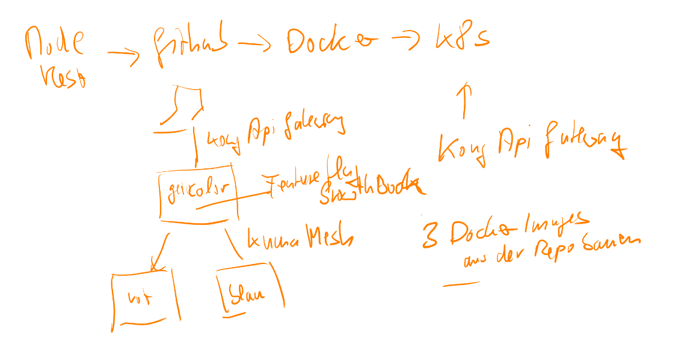

# microservicedemo
a demo microservice projekt

Core Idee:

  

Alles in einer Repo, um auch zu zeige, wie man mit Github Actins mehrere Docker Files in einem Zug erstellen kann (geht das? :)

Sollte dann auf meinem K8S Cluster gehostet werden. Zuerst mal manuela, dann mit Pipeline und so ;)

Nachdem Growthbook Probleme machte, auf unleash als Featuremanagement Tool umgeschwenkt. Dies läuft mit Docker ohne Probleme. 

Installation auf K8S steht noch aus: https://medium.com/@manabie/self-hosting-unleash-with-kubernetes-d6620d0dee11
https://github.com/Unleash/helm-charts

nun im code-server

